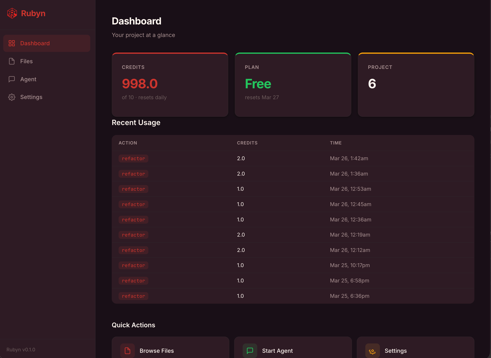
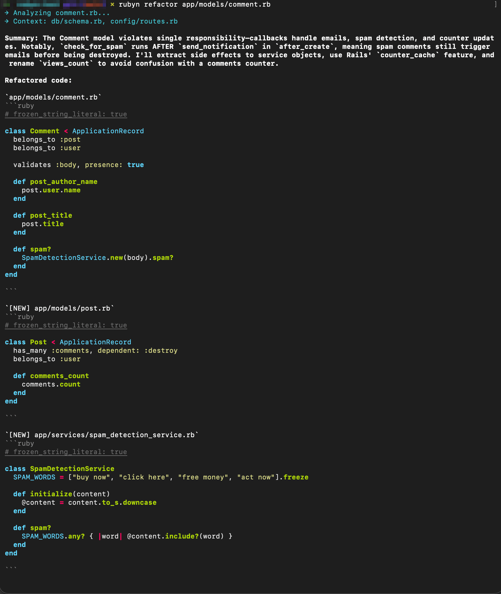

<p align="center">
  
</p>

<h1 align="center">Rubyn</h1>

<p align="center">
  <strong>AI Code Assistant for Ruby & Rails</strong>
</p>

<p align="center">
  <a href="https://rubygems.org/gems/rubyn"></a>
  <a href="https://github.com/MatthewSuttles/rubyn"></a>
  <a href="https://github.com/rubocop/rubocop"></a>
  <a href="LICENSE"></a>
  <a href="https://www.ruby-lang.org"></a>
  <a href="https://github.com/MatthewSuttles/rubyn"></a>
</p>

<p align="center">
  Refactor controllers, generate idiomatic RSpec, catch N+1 queries, and review code for anti-patterns — all context-aware with your schema, routes, and specs. Built for Ruby developers who care about conventions.
</p>

---

<!-- Screenshots: replace these paths with your actual screenshots -->
<p align="center">
  
</p>

<p align="center">
  <em>The Rubyn web dashboard mounted inside your Rails app</em>
</p>

<p align="center">
  
</p>

<p align="center">
  <em>The Rubyn console for those hardcore users</em>
</p>

---

## Why Rubyn?

General AI tools write Ruby like they write Python. Rubyn is different:

- **Rails-native** — Knows when to extract a service object, how to write idiomatic RSpec, and why your controller is too fat
- **Context-aware** — Automatically includes your schema, routes, specs, factories, and related models before generating suggestions
- **Best practices built in** — Every request is enriched with curated Ruby and Rails guidelines matched to what you're working on

---

## Installation

Add Rubyn to your Gemfile:

```ruby
gem "rubyn"
```

Then run:

```sh
bundle install
```

Or install it directly:

```sh
gem install rubyn
```

### Requirements

- Ruby >= 2.7
- Rails >= 6.0 (for the web dashboard engine; the CLI works without Rails)
- A Rubyn API key — sign up at [rubyn.ai](https://rubyn.ai)

---

## Quick Start

### 1. Initialize your project

```sh
rubyn init
```

This will:

- Prompt for your API key (or read from `RUBYN_API_KEY` env var)
- Scan your project (Ruby version, Rails version, test framework, gems)
- Create `.rubyn/project.yml` in your project root

### 2. Refactor a file

```sh
rubyn refactor app/controllers/orders_controller.rb
```

Rubyn pulls in the related model, routes, request spec, and service objects — then suggests idiomatic improvements you can apply with one command.

<!-- Screenshot: CLI refactor output -->
<!--  -->

### 3. Generate specs

```sh
rubyn spec app/services/orders/create_service.rb
```

Generates idiomatic tests that match your project's framework (RSpec or Minitest), factory setup, and assertion style.

### 4. Review code

```sh
rubyn review app/controllers/
```

Catches N+1 queries, SQL injection, missing auth, fat controllers, and other anti-patterns — before your PR.

### 5. Start an interactive session

```sh
rubyn agent
```

Ask Rubyn anything about your codebase. Attach files with `@filename`:

```
you> How should I refactor @app/models/order.rb to use service objects?
rubyn> Looking at your Order model, I'd suggest extracting...
```

---

## Web Dashboard

Rubyn includes a mountable Rails engine that provides a full web UI in development.

```ruby
# config/routes.rb
mount Rubyn::Engine => "/rubyn" if Rails.env.development?
```

Then visit [http://localhost:3000/rubyn](http://localhost:3000/rubyn).

<!-- Screenshot: File browser with categorized files -->
<!--  -->

Features:

- **File Browser** — Browse Ruby files by category (models, controllers, services, etc.) with one-click refactor, spec, and review
- **Refactor View** — Code blocks with Apply button for each file, Apply All for multi-file changes
- **Spec Generator** — Generated specs with Write to File button
- **Code Review** — Findings displayed inline
- **Agent Chat** — Conversational interface
- **Settings** — API key status and preferences

The engine is fully isolated — it uses its own layout, styles, and JavaScript. It will not interfere with your application.

### Non-Rails Projects

```sh
rubyn dashboard
# => Dashboard: http://localhost:9292/rubyn
```

---

## All Commands

| Command | Description |
|---|---|
| `rubyn init` | Initialize Rubyn in your project |
| `rubyn refactor <file>` | Refactor a file toward best practices |
| `rubyn spec <file>` | Generate tests for a file |
| `rubyn review <file_or_dir>` | Review code for anti-patterns |
| `rubyn pr` | Review your changes before opening a pull request |
| `rubyn agent` | Start an interactive conversation |
| `rubyn usage` | Show credit balance and recent usage |
| `rubyn config [key] [value]` | View or set configuration |
| `rubyn dashboard` | Open the web dashboard |

---

## How Context Works

When you refactor a controller, Rubyn automatically includes:

| You pass | Rubyn also loads |
|---|---|
| Controller | Model, routes, request spec, service objects |
| Model | Schema, controller, model spec, factory |
| Service object | Referenced models, service spec |
| Gem lib file | Corresponding spec, sibling classes |

Plus relevant best practice documents matched to the file type — no configuration needed.

---

## Plans

| Feature | Free | Pro | Lifetime |
|---|:---:|:---:|:---:|
| All commands (refactor, spec, review, agent) | Yes | Yes | Yes |
| Web dashboard | Yes | Yes | Yes |
| Convention-based file context | Yes | Yes | Yes |
| Credits | 10/day | 250/month | 250/month |
| Price | Free | $19/mo | $300 one-time |
| Overages | - | $0.05/credit * | $0.05/credit * |

\* Overages are optional and can be turned off at any time in your account settings.

[Compare plans at rubyn.ai/pricing](https://rubyn.ai/pricing)

---

## Configuration

### API Key

```sh
export RUBYN_API_KEY=rk_your_key_here
```

Or stored at `~/.rubyn/credentials` with `0600` permissions.

### Environment Variables

| Variable | Description |
|---|---|
| `RUBYN_API_KEY` | API key (overrides credentials file) |
| `RUBYN_API_URL` | API base URL (default: `https://api.rubyn.ai`) |

---

## Development

```sh
bin/setup
bundle exec rspec      # 412 specs
bundle exec rubocop
```

---

## License

The gem is available as open source under the terms of the [MIT License](LICENSE).
